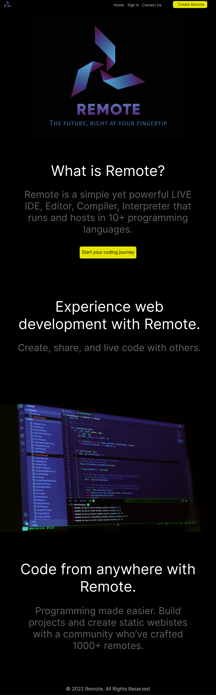
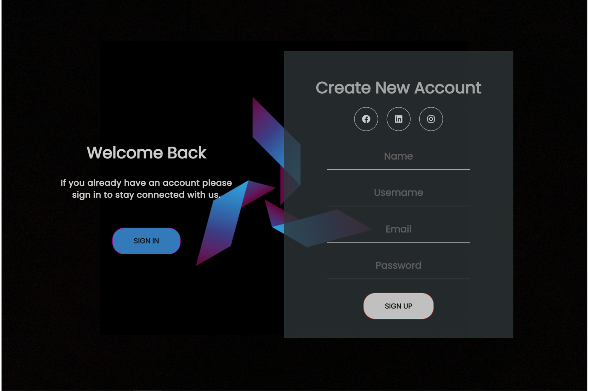
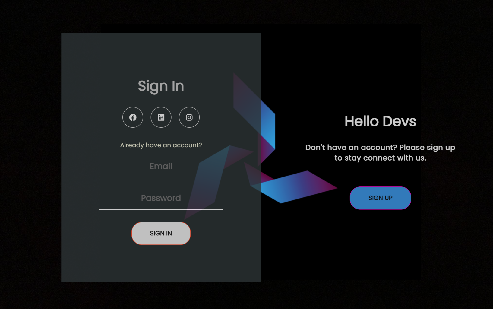
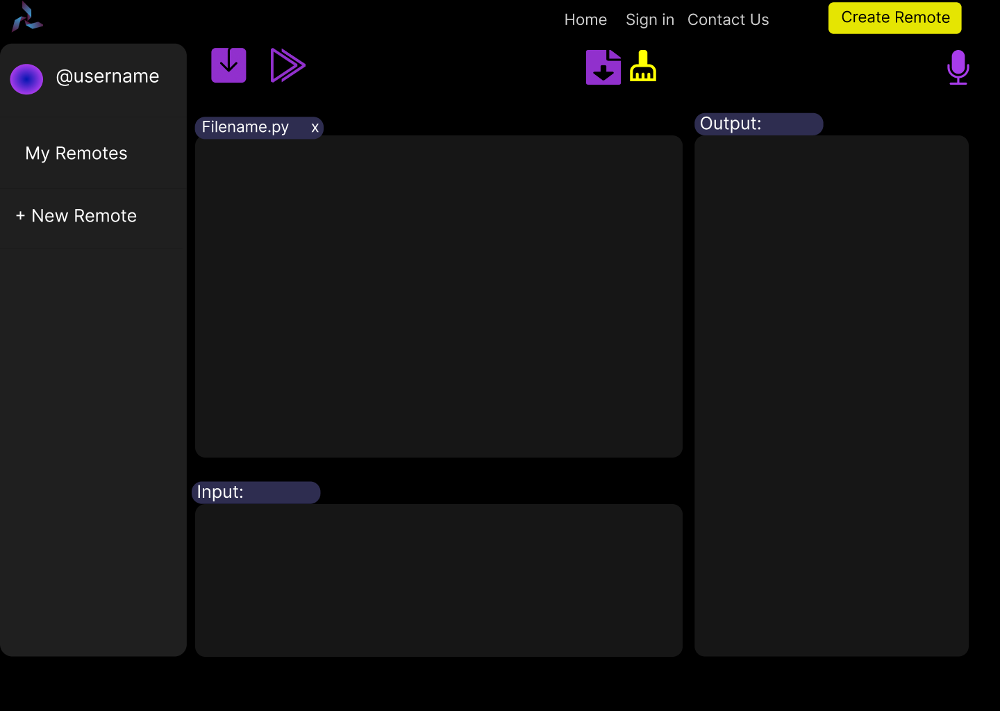
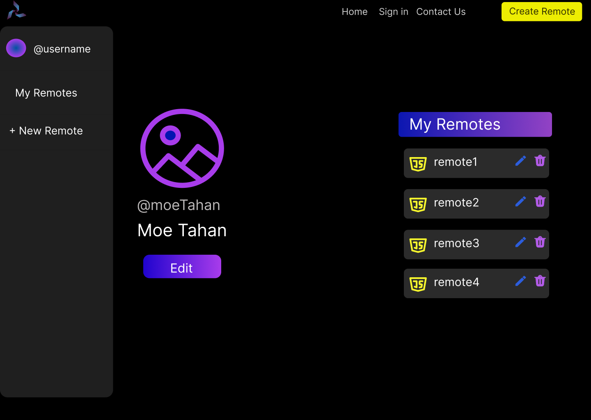

<div align="center">

> Hello world! This is the project’s summary that describes the project plain and simple, limited to the space available. 

**[PROJECT PHILOSOPHY](https://github.com/julescript/well_app#-project-philosophy) • [WIREFRAMES](https://github.com/julescript/well_app#-wireframes) • [TECH STACK](https://github.com/julescript/well_app#-tech-stack) • [IMPLEMENTATION](https://github.com/julescript/well_app#-impplementation) • [HOW TO RUN?](https://github.com/julescript/well_app#-how-to-run)**

</div>

<br><br>


>Remote is an IDE, Editor, Compiler, Interpreter that runs and hosts in several programming languages and it is managed by an Admin.

>Users are able to collaborate, live code, file share, and talk with each other in real-time.

>A Chatbot is available to give the users instructions on how to use the website.

### User Stories
- As a user, I want to be able to write code in different languages.
- As a user, I want to be able to live code with others.
- As a user, I want to be able to save and download other collaborators files.
- As a user, I want to be able to talk with others via live voice chatting.
<br><br>

### Admin Stories
- As an admin, I want to add a new user.
- As an admin, I want to view all registered users.
- As an admin, I want to block users.
- As an admin, I want to view all user messages and delete them.
- As an admin, I want to add a new programming languague.
<br><br>


> This design was planned before on paper, then moved to Figma app for the fine details.
Note that i didn't use any styling library or theme, all from scratch and using pure css modules
| Landing  | Signup  |
| -----------------| ----------------- |
|  |  |
<!-- 



 -->


<!-- | Artists results  | Artist's Albums  |
| -----------------| -----|
|  |  | -->


<br><br>


Here's a brief high-level overview of the tech stack the Remote app uses:

- This project uses the [ReactJS](https://reactjs.org/). ReactJS is a free and open-source front-end JavaScript library for building user interfaces based on UI components.
- For persistent storage (database), the app uses the [MongoDB](https://www.mongodb.com/) package which allows the app to create a custom storage schema and save it to a local database.
- For real-time coding and file sharing, the app uses the [socket.io](https://socket.io/) package.
- For the voice chatting, the app uses the [videosdk](https://www.videosdk.live/) package.
- For the ChatBot, the app uses the [react-chatbot-kit](https://fredrikoseberg.github.io/react-chatbot-kit-docs/docs/)package.
- For sending emails, the app uses [emailJs](https://www.emailjs.com/) package.

<br><br>


> Using the above mentioned tech stacks and the wireframes build with figma from the user sotries we have, the implementation of the app is shown as below, these are screenshots from the real app
| Landing  | Home/Search  |
| -----------------| -----|
|  |  |


<br><br>


> This is an example of how you may give instructions on setting up your project locally.
To get a local copy up and running follow these simple example steps.
### Prerequisites

This is an example of how to list things you need to use the software and how to install them.
* npm
  ```sh
  npm install npm@latest -g
  ```

### Installation

_Below is an example of how you can instruct your audience on installing and setting up your app. This template doesn't rely on any external dependencies or services._

1. Get a free API Key at [https://example.com](https://example.com)
2. Clone the repo
   ```sh
   git clone https://github.com/your_username_/Project-Name.git
   ```
3. Install NPM packages
   ```sh
   npm install
   ```
4. Enter your API in `config.js`
   ```js
   const API_KEY = 'ENTER YOUR API';
   ```

