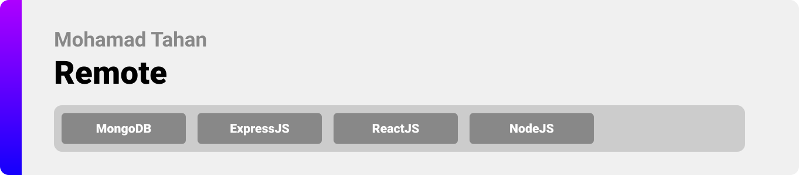
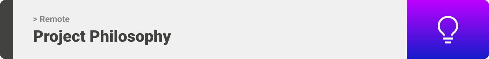
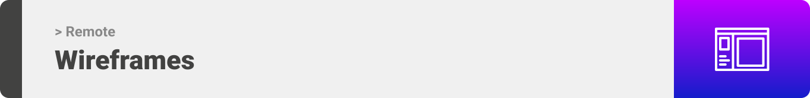
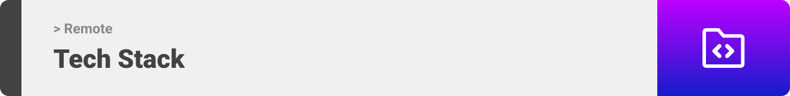
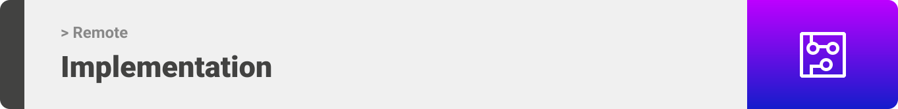
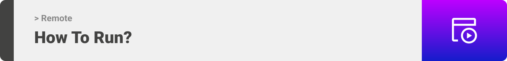

<div align="center">

> Hello world! This is the project’s summary that describes the project plain and simple, limited to the space available. 

> **[PROJECT PHILOSOPHY](https://github.com/julescript/well_app#-project-philosophy) • [WIREFRAMES](https://github.com/julescript/well_app#-wireframes) • [TECH STACK](https://github.com/julescript/well_app#-tech-stack) • [IMPLEMENTATION](https://github.com/julescript/well_app#-impplementation) • [HOW TO RUN?](https://github.com/julescript/well_app#-how-to-run)**

</div>

<br><br>



> Remote is an IDE, Editor, Compiler, Interpreter that runs and hosts in several programming languages and it is managed by an Admin.

> Users are able to collaborate, live code, file share, and talk with each other in real-time.

> A Chatbot is available to give the users instructions on how to use the website.

### User Stories

- As a user, I want to be able to write code in different languages.
- As a user, I want to be able to live code with others.
- As a user, I want to be able to save and download other collaborators files.
- As a user, I want to be able to talk with others via live voice chatting.
  <br><br>

### Admin Stories

- As an admin, I want to add a new user.
- As an admin, I want to view all registered users.
- As an admin, I want to block users.
- As an admin, I want to view all user messages and delete them.
- As an admin, I want to add a new programming languague.
  <br><br>



> This design was planned before on paper, then moved to Figma app for the fine details.
> Note that i didn't use any styling library or theme, all from scratch and using pure css modules.
> <br>
> | Landing | Signup/Signin/Profile |
> | ----------------- | ----------------- |
> |  |    |

> | Remote |
> | -----------------|
> |  |


<br><br>



Here's a brief high-level overview of the tech stack the Remote app uses:

- This project uses [React](https://reactjs.org/). React is a free and open-source front-end JavaScript library for building user interfaces based on UI components.
- For persistent storage (database), the app uses the [MongoDB](https://www.mongodb.com/) package which allows the app to create a custom storage schema and save it to a local database.
- For real-time coding and file sharing, the app uses the [socket.io](https://socket.io/) package.
- For the voice chatting, the app uses the [videosdk](https://www.videosdk.live/) package.
- For the ChatBot, the app uses the [react-chatbot-kit](https://fredrikoseberg.github.io/react-chatbot-kit-docs/docs/) package.
- For sending emails, the app uses [emailJS](https://www.emailjs.com/) package.

<br><br>


> Using the above mentioned tech stacks and the wireframes build with figma from the user sotries we have, the implementation of the app is shown as below, these are screenshots from the real app
> | Landing | 
> | ----------------- | 
>   

> | Login |
> | ----------------- |
>   

> | Join a Room | Create a Remote |
> | ----------- | --------------------- |
> |  |  |

> | Run Code1 | Run Code2 |
> | ----------------- | ----------------- |
> |  |  |

> | Code Example |
> | ----------------- |
>   

> | Run User Input |
> | ----------------- |
>   

> | Save/Download/Clear |
> | ----------------- |
>   

> | ChatBot |
> | ----------------- |
>   

> | Profile/UpdateInfo | Profile/UpdateFile |
> | ----------------- | ----------------- |
> |  |  |

> | Contact Us / Email Message |
> | ----------------- |
>   

> | Real-Time Coding / File Sharing / Voice Chatting |
> | ----------------- |
>
https://user-images.githubusercontent.com/105279273/182948983-b41a71ba-82d6-46a1-bfed-3d4dc130a834.mp4


> | Admin / Add a User |
> | ----------------- |
>   

> | Admin / View - Search - Block Users |
> | ----------------- |
>   

> | Admin / Add a Language |
> | ----------------- |
>   


> | Admin / Messages |
> | ----------------- |
>   


<br><br>



> To get a local copy up and running follow these simple steps.

### Prerequisites

This is an example of how to list things you need to use the software and how to install them.

- npm
> Download and install [Node.js](https://nodejs.org/en/download/)


### Installation


1. Clone the repo
   ```sh
   git clone https://github.com/mohamad-tahan/Remote.git
   ```
2. Get a free API Key to run your code at [Judge0](https://rapidapi.com/judge0-official/api/judge0-ce/)

3. Enter your API in `.env`
   ```js
   REACT_APP_RAPID_API_KEY= "ENTER YOUR API KEY";
   REACT_APP_RAPID_API_HOST= "ENTER YOUR API HOST";

   ```

 #### To Run The Backend:  
 1. Navigate to the backend folder
   ```sh
   cd Remote/backend
   ```
 2. Install NPM Packages  
  ```sh
   npm install
   ```
   #### To Run The Frontend:  
 1. Navigate to the frontend folder
   ```sh
   cd Remote/frontend
   ```
2. Install NPM Packages  
  ```sh
   npm install
   ```

  
